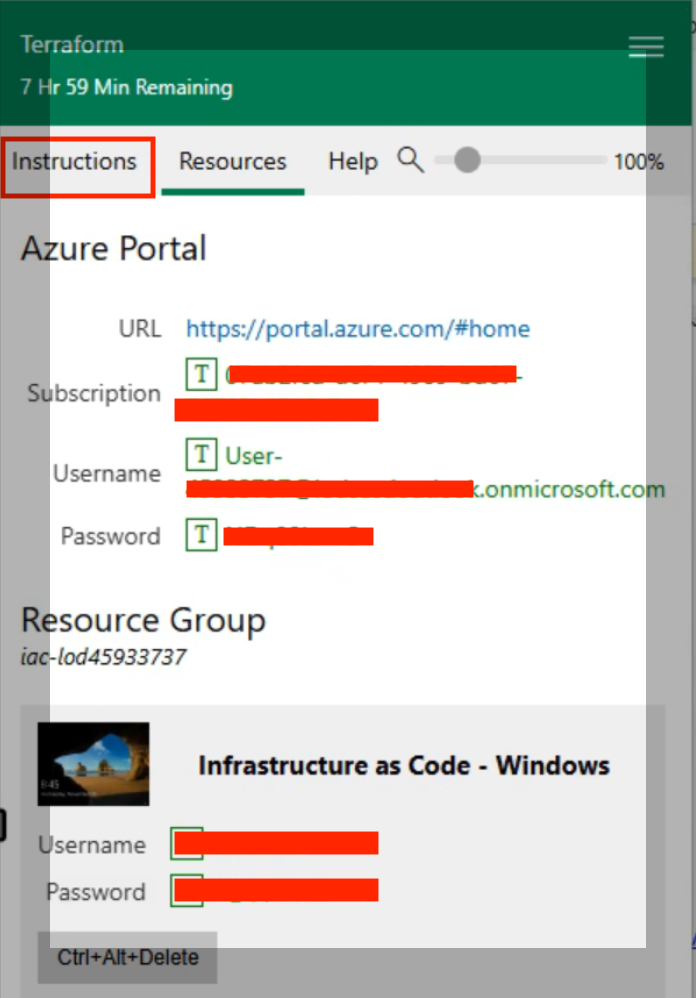

## Terraform Lab Introduction

In these labs, you will gain hands-on exposure to setting up Terraform environment, building and deploying Terraform scripts to deploy Azure resources. You will learn how to authenticate with Terraform's Azure Provider, manage Terraform state on Azure, and how to stand up resources in Azure using Terraform.

The labs includes a self-paced [exercise/challenge](https://github.com/sekar3s/Terraform-Lab/blob/main/Lab/Lab%2003%20-%20Creating%20Terraform%20Modules.md) (in Lab 03) to help you build a Terraform code as a challenge. The labs are split into five parts which build up on each other. 

> **Total Estimated Duration**: 5-6 hours (split into three days)

---

## Pre-requisites

1. Launch the Virtual Lab session (Access/Training key will be provided by your instructor on the day of the workshop).
2. The virtual session will be active for 7 days after saving, otherwise it will expire after 8 hours. Please make sure to Save the session before wrapping up for the day.
3. This document will replace the instructions you will under the “Instructions” (shown in screenshot below) tab/pane of the lab.
4. The labs are designed to completed in order, with each one building on the previous.
5. **Please make sure to read the NOTES in the steps in each section of the lab as some steps have specific requirements and instructions.**
6. Please reach out to the instructor if you have any questions or if you are stuck with any of the steps.

---

## Lab Components

[Lab 0](https://github.com/sekar3s/Terraform-Lab/blob/main/Lab/Lab%200%20-%20Install%20and%20Configure%20Terraform.md) – Install and Configure Terraform (Duration: 15 minutes)

[Lab 1](https://github.com/sekar3s/Terraform-Lab/blob/main/Lab/Lab%2001%20-%20Azure%20Provider%20-%20Authenticating.md) - Azure Provider – Authenticating (Duration: 1 hour 15 minutes)

[Lab 2](https://github.com/sekar3s/Terraform-Lab/blob/main/Lab/Lab%2002%20-%20Managing%20Terraform%20State%20on%20Azure.md) - Managing Terraform State on Azure (Duration: 1 hour)

[Lab 3](https://github.com/sekar3s/Terraform-Lab/blob/main/Lab/Lab%2003%20-%20Creating%20Terraform%20Modules.md) - Creating Terraform Modules (Duration: 1 - 1.5 hours)

[Lab 4](https://github.com/sekar3s/Terraform-Lab/blob/main/Lab/Lab%2004%20-%20Deploying%20Resources.md) - Deploying Resources (Duration: 1 hour)

[Lab 5](https://github.com/sekar3s/Terraform-Lab/blob/main/Lab/Lab%2005%20(OPTIONAL)%20-%20Provision%3AAutomate%20Changes.md) (OPTIONAL) - Provision/Automate Changes on Virtual Machine (Duration: 1 hour)
