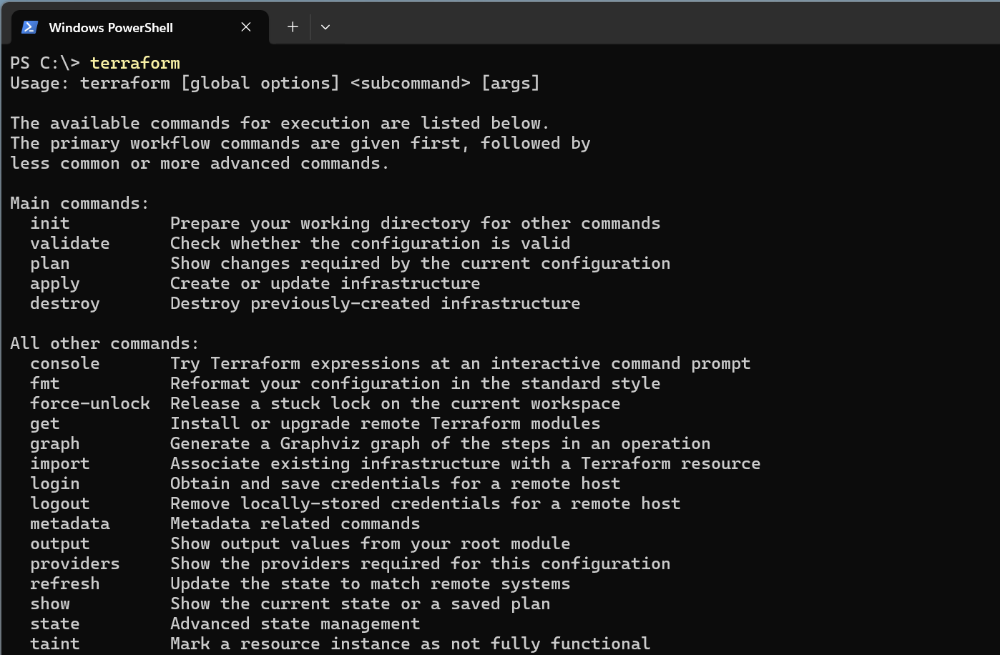
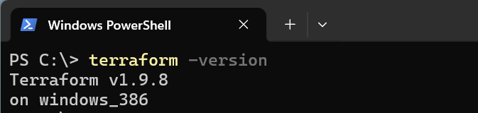
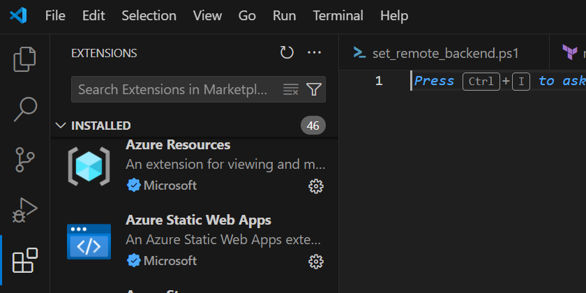
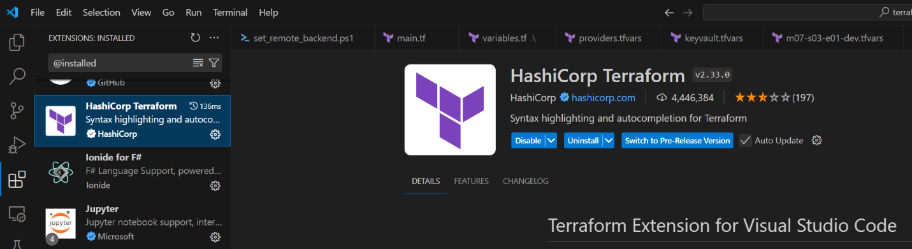

## Lab: Install and Configure Terraform

In this lab, you will install and configure Terraform to prepare the environment ready for hands-on

> **Estimated Duration**: 15 minutes

---

### Download and Install Terraform for Windows

1.  Create the folder `C:\Program Files\Terraform`

2.  Open Terraform download page <https://www.terraform.io/downloads.html>

3.  Select 64-bit (386 version) and download the zip file (e.g.: terraform_1.9.8_windows_386) – **Latest version is 1.9.8** as of Nov 2024

4.  Open the folder where you saved the downloaded file, and unzip the package in the folder you created in the step 1 `C:\\Program Files\\Terraform\\.` Terraform runs as a single binary named **terraform.exe**

5.  Now we will make sure that the terraform binary is available on the PATH. **Open Control Panel** -\> **System** -\> **Advanced System settings** -\> **Environment Variables**

6.  In the **System Variables** panel, scroll down until you find **PATH**, then select **Path** and click **Edit**

7.  In the **Edit environment variable** window, click **New**

8.  Enter `C:\\Program Files\\Terraform\\`

9.  Click **OK** in all three windows closing the **System Properties** completely
---

### Validating Terraform installation

After installing Terraform, verify that the installation worked, and what is the Terraform version.

1.  Open CMD

2.  Type terraform press **Enter**

3.  You will see the following result

4.  Now type terraform -version to validate Terraform installed version (As of Nov 2024, the latest version is 1.9.8. The version should be 1.9.8 or higher)

--- 

### Install the Terraform Visual Studio Code extension

1.  Launch **Visual Studio Code**

2.  Open the **Extensions** view

    -   Windows/Linux: Ctrl+Shift+X

    -   macOS: Shift+⌘+X

3.  Use the **Search Extensions** in Marketplace text box to search for the *Terraform* extension (pick HashiCorp Terraform)

4.  Select **Install** [Terraform](https://marketplace.visualstudio.com/items?itemName=mauve.terraform)

---

### Verify the Terraform extension is installed in Visual Studio Code

1.  Select **Extensions**

2.  Enter @installed in the search text box

3.  The Terraform extension will appear in the list of installed extensions

4.  You can now run all supported Terraform commands in your Cloud Shell environment from within Visual Studio Code

---

## Summary

In this LAB we completed the following activities

1.  Installation of prerequisites to run a Terraform template, by installing Azure CLI manually
2.  Download of Terraform, and system variables configuration to execute Terraform from Path in the local system
3.  Validation of Terraforms by checking the Terraform version
4.  Installation of Terraform extension for VS Code
5.  Validation of Terraform VS Code extension

