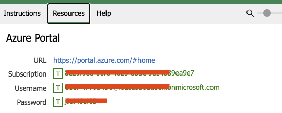
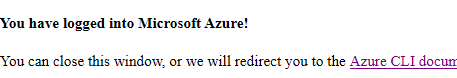
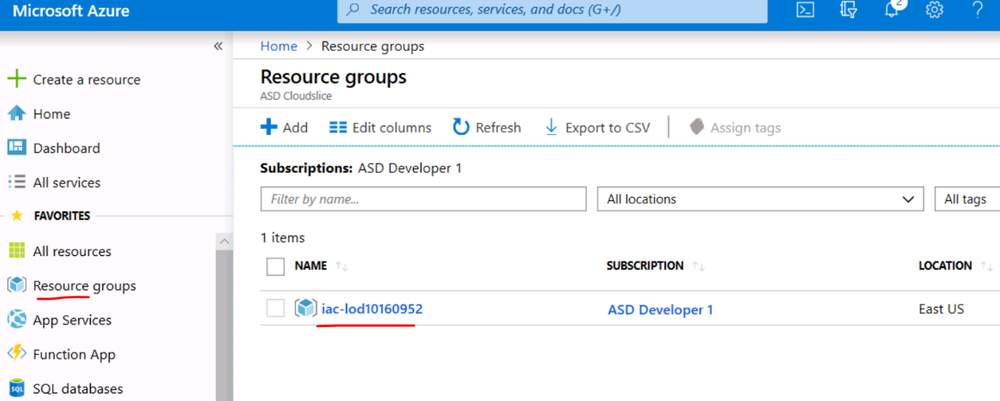
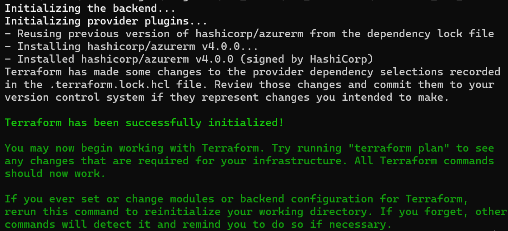
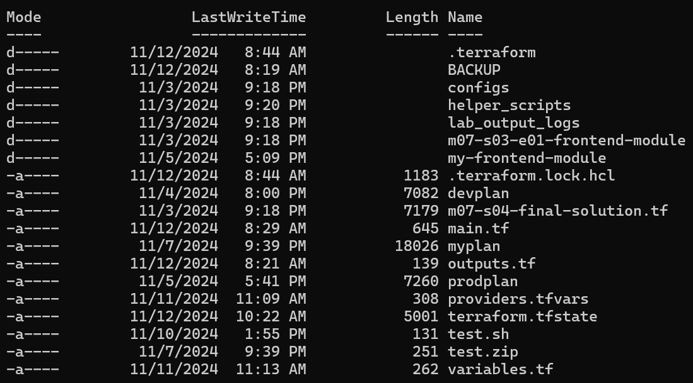
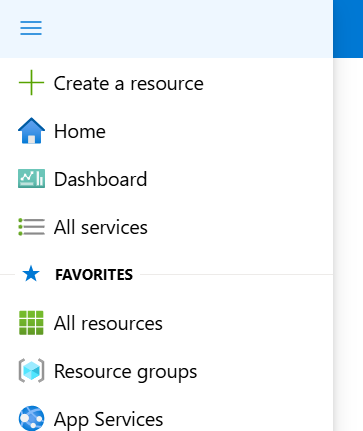

## Lab 01 - Azure Provider - Authenticating

In this lab, you will install and configure Terraform to prepare the environment ready for hands-on

> **Estimated Duration**: 1 hour 15 minutes

---

Terraform supports a number of different methods for authenticating to Azure:

-   Authenticating to Azure using the Azure CLI (**we will be using this method**)

-   Authenticating to Azure using Managed Service Identity

-   Authenticating to Azure using a Service Principal and a Client Certificate

-   Authenticating to Azure using a Service Principal and a Client Secret

Terraform recommends using either a Service Principal or Managed Service Identity when running Terraform non-interactively (such as when running Terraform in a CI server) - and authenticating using the Azure CLI when running Terraform locally.

---

Terraform recommends using either a Service Principal or Managed Service Identity when running Terraform non-interactively (such as when running Terraform in a CI server) - and authenticating using the Azure CLI when running Terraform locally.

#### <ins> Setting up the Terraform provider <ins>

In Terraform there are multiple [providers](https://www.terraform.io/docs/providers/index.html). A provider is responsible for understanding API interactions and exposing resources. Terraform basically adds an abstraction layer to json ARM templates which are the payloads that Azure's API interacts. You may create, manage, and update infrastructure for building resources such as physical machines, VMs, network switches, containers, and more.

In this lab, we will, of course, be using the [Azure provider](https://www.terraform.io/docs/providers/azurerm/index.html). The following Provider block can be specified. The Azure Provider version we will use in this lab will be 4.0.0

#### <ins> Prerequisites <ins>

Navigate to the terraform_lab_dir where you will be writing code for your lab and ensure the prebuilt terraform file contents exist. You can use the Command Prompt or Windows file explore to perform this task.

```powershell
cd C:\Lab_Files\M07_Terraform\terraform_lab_dir
```

#### <ins> Service Principal <ins>

A Service Principal is an application within Azure Active Directory whose authentication tokens can be used as the client_id, client_secret, and tenant_id fields needed by Terraform (subscription_id can be independently recovered from your Azure account details).

It's possible to complete this task in either the Azure CLI or in the Azure Portal - For the purpose of this lab, we will simply authenticate with our user credentials. However, it is important to note that authenticating via a Service Principal with a client secret which has the minimum rights needed to the subscription is the standard authentication method for an automation pipeline.

**NOTE: You will need both CLI and Powershell versions for this lab.**

#### <ins> Install Azure CLI <ins>

1.  Navigate [here](https://learn.microsoft.com/en-us/cli/azure/install-azure-cli-windows?tabs=azure-cli) for installation instructions. Please make sure you download and install the 64 bit version. 

#### <ins>  Login to azure Powershell Az <ins>

1.  Open a new Command Prompt session as an “Administrator” user and  Invoke/Launch the PowerShell using `powershell` command. **NOTE:** Administrator privileges are necessary to perform the installation of module below, otherwise you will get an error. 

   ```console
powershell
   ```

2.  Install Azure PowerShell Module. You need to provide a prompt (Select [A] Yes to All) and agree to the installation of the module which will take a while. The installation will complete after a few minutes and if you are stuck with a cursor, press Enter to complete it.
   ```powershell
Install-Module -Name Az
   ```

3.  Import Azure PowerShell Module. Similar to the installation, the import will run in the background and take a few minutes. The import will complete after a few minutes and if you are stuck with a cursor for a long time, press Enter to complete it.
   ```powershell
Import-Module -Name Az
   ```

4.  Connect Azure Account
   ```powershell
Connect-AzAccount
   ```

5.  Your default browser will pop up and prompt you for credentials. Select **Work/School** and input your credentials, which can be found under the Resources tab in the lab portal. 



6.  Get the Azure Subscription and copy the id to be used in the next step. You can also find the Subscription ID under the "Resources tab" in the lab portal.
   ```powershell
Get-AzSubscription
   ```

7.  Set the Azure subscription. Replace the subscription ID from the output of step 6.
   ```powershell
Set-AzContext -Subscription <INSERT THE DESIRED SUBSCRIPTION ID>
   ```

#### <ins>  Login to azure Azure CLI <ins>

1.  Login into Azure account using CLI. You can either use the same PowerShell session from the above section or use a Command Prompt. 
   ```console
   az login
   ```

2.  Your default browser will pop up and prompt you for credentials. Select **Work/School** and input your credentials.

3.  Select the subscription by prompting the relevant number and hit "Enter"

4.  Once logged in, you will see a page like this. At this point you may navigate back to your already authenticated powershell session 

5.  Once logged in - it's possible to list the Subscriptions associated with the account. The output (similar to below) will display one or more Subscriptions - with the id field being the subscription_id field referenced above.
   ```console
   az account list
   ```

```shell
[
{
"cloudName": "AzureCloud",
"id": "00000000-0000-0000-0000-000000000000",
"isDefault": true,
"name": "PAYG Subscription",
"state": "Enabled",
"tenantId": "00000000-0000-0000-0000-000000000000",
"user": {
"name": "user@example.com",
"type": "user"
   }
}
]
```

6.  Copy the subscription ID, which you will be using throughout this course. You can also find the Subscription ID under the "Resources tab" in the lab portal.

7.  Set the Azure subscription. Replace the subscription ID from the output above. 
   ```console
   az account set --subscription <INSERT THE DESIRED SUBSCRIPTION ID>
   ```
8.  Congrats! You have successfully authenticated and set your subscription.

#### <ins>  Creating Terraform <ins>

1. Open/Launch VS Code and open the project folder ```C:\Lab_Files\M07_Terraform\terraform_lab_dir\```. Select `terraform_lab_dir` folder which will be our home folder for the project.

2. Replace the content in the file ```C:\Lab_Files\M07_Terraform\terraform_lab_dir\main.tf``` with the content below and save the file. We also need the subscription ID in the provider block starting from version 4.0.0 as shown [here](https://registry.terraform.io/providers/hashicorp/azurerm/latest/docs/guides/4.0-upgrade-guide#specifying-subscription-id-is-now-mandatory). We will be setting the variable later in the next section and providing the subscription ID using a variable.

```tf
terraform {
  required_providers {
    azurerm = {
      source  = "hashicorp/azurerm"
      version = "4.0.0"
    }
  }
}

provider "azurerm" {
  features {}

  subscription_id = var.azurerm_provider_subscription_id
}
```
When we run ```terraform plan/apply``` commands in the later section, Terraform will authenticate using the existing session that we established via azure cli.

3.  *Append* the code below to the same file, `.\main.tf`. Make sure to append the code and not replace the code that we already placed in the `.\main.tf` file.

```tf
data "azurerm_resource_group" "main" {
  name = var.rg_name
}
```

Please note, *data* sources allow data to be fetched or computed for use elsewhere in Terraform configuration. Use of data sources allows a Terraform configuration to make use of information defined outside of Terraform, or defined by another separate Terraform configuration. The code above is fetching an existing resource of type [azurerm_resource_group](https://www.terraform.io/docs/providers/azurerm/r/resource_group.html) which is a resource that comes from the azurerm provider. We have given it a local name "main" so that we may reference it in this fashion later, data.azurerm_resource_group.main. Please learn more [here](https://www.terraform.io/docs/configuration/data-sources.html)

4.  Also, *append* the code below to the same file, `.\main.tf` and save the file.

```tf
resource "azurerm_public_ip" "vm" {
  name                = "mypip"
  location            = data.azurerm_resource_group.main.location
  resource_group_name = data.azurerm_resource_group.main.name
  allocation_method   = "Static"
  depends_on          = [data.azurerm_resource_group.main]

    tags = {
    environment = "dev"
  }
}
```

This will deploy a resource of type [azurerm_public_ip](https://www.terraform.io/docs/providers/azurerm/r/public_ip.html) which is a resource that comes from the azurerm provider. We have given it a local name "vm". Learn more on resource syntax [here](https://www.terraform.io/docs/configuration/resources.html). In addition, to learn more about the hcl configuration language, please review this [doc](https://www.terraform.io/docs/configuration/index.html)

#### <ins>  Terraform Variables <ins>


In step 1 above and in the previous section, you would have noticed that we are using this syntax, `var.rg_name` and `var.azurerm_provider_subscription_id`. We need to ensure that these variables and their values are constructed.

1.  *Append* the code below in the file `.\variables.tf` and save the file.

```tf
variable "rg_name" {
  type        = string
  description = "The name of the resource group"
  default     = "XXXXX"
}

variable "azurerm_provider_subscription_id" {
  type        = string
  description = "Subscription ID"
  default     = "XXXXX"
}
```

You will see that the variable default value is a dummy. We will construct a [tfvars](https://www.terraform.io/docs/configuration/variables.html#variable-definitions-tfvars-files) file which will be injected into this variables file via command line argument later on.

**NOTE:** we could have simply appended the above code to the same main.tf file that the provider object sits on. However, it is best practice to separate variables from code.

#### <ins>  Terraform tfvars <ins>

1.  Navigate to https://portal.azure.com. If you are not already logged in, log in using the same Username and Password you used to authenticate to Azure using PowerShell and the CLI.

2.  In the left blade, click *Resource Groups*

3.  In the lab, there will be one Resource Group. *Copy* the name 

4.  Append the below code in the file `.\providers.tfvars` and insert the value copied from the previous step inside "" 

```tf
rg_name = "<insert value>"
```

5.  Set the Subscription ID variable in `.\providers.tfvars` file. The Subscription ID can be found from the Azure portal (under Subscriptions). You can also find the Subscription ID under the "Resources tab" in the lab portal.

```tf
azurerm_provider_subscription_id = "<insert subscription ID here>"
```

#### <ins>  Terraform Outputs <ins>

1.  Let's ensure we output the main object upon deploying. Later, you will run a command that will output this variable. Ensure the below code exists in `.\outputs.tf`

```tf
output "rg_main_output" {
  value = "${data.azurerm_resource_group.main}"
}
```

The above code will output the `rg_main_output` object which has a value of `data.azurerm_resource_group.main`, the local object you instantiated at the step above.

2.  Also append the below code to, `.\outputs.tf`

```tf
output "vmEndpoint" {
  value = azurerm_public_ip.vm
}
```

The above code will output the value created by the step above.

3.  Save all changes (File > Save All)

#### <ins>  Running Terraform (DON'T RUN THESE COMMANDS YET!) <ins>

When using Terraform, there are 3 basic commands that you must know

-   [terraform init](https://www.terraform.io/docs/commands/init.html) - to initialize the working directory

-   [terraform plan](https://www.terraform.io/docs/commands/plan.html) - to create a plan

-   [terraform apply](https://www.terraform.io/docs/commands/apply.html) - to apply the plan

1.  Using VS code menu, open a new PowerShell session (Terminal -> New Terminal). Let's add/append the az CLI binary to the PATH variable. Run the command below to add the az CLI directory to the PATH variable. This is important for Terraform to authenticate using the CLI.

```powershell
$env:Path = 'C:\Program Files\Microsoft SDKs\Azure\CLI2\wbin\;' + $env:Path
```

2. Let's access the terraform init, plan, and apply methods. Run `terraform init --help` and skim through the capabilities. Feel free to ask questions during this time. **NOTE:** If you are not in the `C:\Lab_Files\M07_Terraform\terraform_lab_dir\` directory, switch to the directory before you run terraform commands.

3.  Run Terraform plan

```console
terraform plan --help
```

4.  Run Terraform apply

```console
terraform apply --help
```

5.  Run Terraform init 

```console
terraform init
```

**NOTE:** Every time we introduce a new module, we must run Terraform init. [Terraform init](https://www.terraform.io/docs/commands/init.html) is used to initialize a working directory containing terraform configuration files. This is the first command that should be run after writing a new Terraform configuration or cloning an existing one from version control. It is safe to run this command multiple times.

You should receive something similar to the below output



6.  As a result of the last step, you will see a `.terraform` folder was automatically created in your working directory. Terraform's *init* managed a few things such as:

    a.  Backend Initialization (which we will cover in a later lab)

    b.  Child Module Installation

    c.  Plugin Installation

   For more detail on Terraform init, please visit [here](https://www.terraform.io/docs/commands/init.html)

7.  Inject the `providers.tfvars` file and run terraform plan. **NOTE:** If you run into issues related to "az" command being not recognized, you probably missed to set the PATH mentioned in step 1 of [Running Terraform section](https://github.com/sekar3s/Terraform-Lab/blob/main/Lab/Lab%2001%20-%20Azure%20Provider%20-%20Authenticating.md#--running-terraform-dont-run-these-commands-yet-)
      
```console
terraform plan -var-file="providers.tfvars"
```

**NOTE:** `terraform plan` is an intermittent step to run before actually deploying your resources. This command is a convenient way to check whether the execution plan for a set of changes matches your expectations without making any changes to real resources or to the state.

8.  Run terraform apply and **enter yes** when prompted to perform the actions described in the output.  
      
```console
terraform apply -var-file="providers.tfvars"
```

**NOTE:** [terraform apply](https://www.terraform.io/docs/commands/apply.html) is the command that actually deploys your resources. This command is used to apply the changes required to reach the desired state of the configuration, or the pre-determined set of actions generated by a terraform plan execution plan.

9.  Run `ls`. This will show the contents of the current working directory.



You will see that a new file was created after you ran terraform apply. This ``.tfstate` file is needed for Terraform to keep track of the state of your target infrastructure. This state is used by Terraform to map real world resources to your configuration, keep track of metadata, and to improve performance for large infrastructures. If your .terraform folder uses a local backend to keep track of .tfstate, this state file will be updated upon each new terraform apply. This [state](https://www.terraform.io/docs/state/) is stored by default in a local file named "terraform.tfstate", but it can also be stored remotely, which works better in a team environment. We will cover state more in depth in a separate lab.

10.  Run terraform plan again but with the `-out` parameter now, which will save the output to a file named myplan.  
      
```console
terraform plan -var-file="providers.tfvars" -out myplan
```

You will see that there are no changes to apply since the code has already been applied to the target resources.

11.  Run terraform apply again. (Because you used the `-out` argument, your plan was saved to *myplan*. Simply, you do not have to re-inject the tfvars files like you did for step 6 above). You will see that no changes will be made, and it was quite pointless to run an apply after seeing the plan had 0 changes in the previous step.

```console
terraform apply myplan
```

12.  Navigate to your subscription in the Azure Portal at <https://portal.azure.com> and click Resource Groups in the left blade.



13.  Click on the Resource Group named and you will see that Terraform did indeed create a public ip to an existing Resource Group by authenticating through the existing azure cli session.

14.  **CONGRATS!** You finished the LAB1 Module that will allow you to deploy resources using Terraform through azure cli. From this point, you are able to create Azure Resources in the existing resource group using Terraform.
