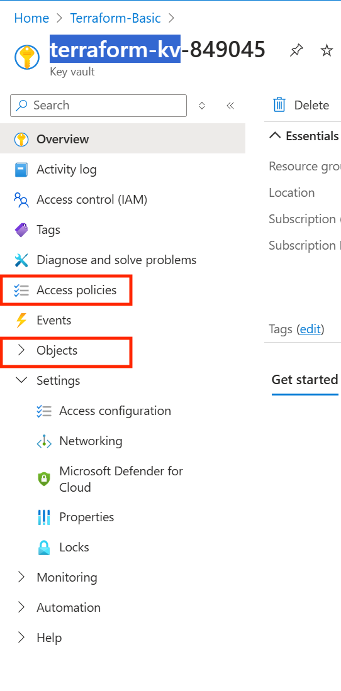

## Lab 02 - Managing Terraform State on Azure

In this lab, you will install and configure Terraform to prepare the environment ready for hands-on

> **Estimated Duration**: 1 hour

---

Terraform state is used to reconcile deployed resources with Terraform configurations. Using state, Terraform knows what Azure resources to add, update, or delete. By default, Terraform state is stored locally when running *Terraform apply*. This configuration is not ideal for a few reasons:

-   Local state does not work well in a team or collaborative environment

-   Terraform state can include sensitive information

-   Storing state locally increases the chance of inadvertent deletion

Centralizing your state file is a solution. In this lab, we will be doing just that. A common solution is to place your state file in an Azure Blob Storage Account that is locked down to the bare minimum. It is important to lock this down because Terraform prints out your state as is. This may include sensitive resource data like passwords. Also, please note that terraform supports state locking and consistency checking via native capabilities of Azure Blob Storage. This ensures there are no conflicts if multiple processes to terraform apply were to run.

#### <ins> Create the Storage Account and store the access key in key vault <ins>

Before using Azure Storage as a backend, a storage account must be created. The storage account can be created with the Azure portal, PowerShell, the Azure CLI, or Terraform itself. In this lab, we will deploy through the Azure CLI.

In this lab, there is a helper script that will

-   create a storage account named *terraformstate* followed by a random string

-   create a container in the account named *terraformstate* (**Note:** we can create different containers to host terraform states for different environments like production, stage, etc.)

-   create a key vault named *terraform-kv-* followed by the same random string as the storage account

-   set access policies to the key vault for the account associated to the email given as input and application id given as input

-   create a key vault secret with the name *ARM-ACCESS-KEY* and value of the storage account access key

-   stores information to be used throughout the lab in a file at `terraform_lab_dir\lab_output_logs\remote_backend.log`

**NOTE:** We can certainly place the storage account access key in a tfvars file as we did with the client secret in providers.tfvars. However, in this lab, we will show you a more secure option in which the secret only lives locally during the lifetime of your powershell session.

#### <ins> Lab 02 Steps <ins>

1.  Open/Launch the VS Code Terminal/Powershell session and navigate to the terraform_lab_dir where you will be writing code for your lab.

```console
cd C:\Lab_Files\M07_Terraform\terraform_lab_dir
```

2.  Replace the entire content of file in `.\helper_scripts\set_remote_backend.ps1` with the content from the github file below. Save the file after replacing the contents. **NOTE:** DON'T FORGET TO SAVE THE SCRIPT OTHERWISE YOU WILL END UP RUNNING THE OLD SCRIPT AND THE CLEAN UP IS A BIT TEDIOUS

<https://github.com/sekar3s/Terraform-Lab/blob/main/set_remote_backend.ps1>

3.  [Login to azure (Azure CLI)](https://learn.microsoft.com/en-us/cli/azure/authenticate-azure-cli-interactively) [Using `az login` command in PowerShell]

4.  [Login to azure Powershell Az](https://learn.microsoft.com/en-us/powershell/azure/authenticate-interactive) [Using `Connect-AzAccount` command in PowerShell] (The script in the next step requires to run a mix of azure cli and azure powershell commands)

5.  In the terminal, **run** the script found at this location `.\helper_scripts\set_remote_backend.ps1` with the following parameters shown followed by parameters (remember to place double quotes) -adminEmail `"<insert the email account you use to login to the Azure subscription>"` -resource_group_name `"<Insert the name of the existing resource group. This value is assigned to rg_name in ./providers.tfvars>"`. Below is an example of how this command will look like:

```console
.\helper_scripts\set_remote_backend.ps1 -adminEmail "joesmith@contoso.com" -resource_group_name "myrg"
```

Select **[R] Run once** option. You should see output like the following

```console
Checking for an active Azure login..............................................SUCCESS!

Creating Storage Account [terraformstate044330] and Container [terraformstate]...

SUCCESS!

Creating Terraform KeyVault: [terraform-kv-044330].............................SUCCESS!

Setting KeyVault Access Policy for Admin User: [joesmith@contoso.com]........SUCCESS!

Setting KeyVault Access Policy for Terraform SP with appid: [xxxx-4444-439a-lkj4-afa6f0983jrec]...SUCCESS!

Creating KeyVault Secret(s) for Terraform......................................SUCCESS!

Writing output to .\lab_output_logs\remote_backend.log
```

6.  When the script completes, it will have written information about the storage account and key vault in `.\lab_output_logs\remote_backend.log` so that you can reference the information throughout the lab. (Please disregard that the storage access_key value is stored in this file which defeats the whole purpose of the lab. We have placed it there for easy referencing for lab purposes.)

7.  Open the file `.\lab_output_logs\remote_backend.log` in VS code to see the contents.

**Let's double check our work**

1.  Navigate to your subscription in the Azure Portal at [https://portal.azure.com](https://portal.azure.com/) and click Resource Groups in the left pane. Click on your Resource Group and see the resources deployed from this script.

2.  Navigate to the Azure Key Vault resource named terraform-kv-\* (where \* is a random string)

3.  Check that the Access Policies were configured by navigating to “Access policies” on the left pane. You should see one policy.

4.  Check that the secret was uploaded to Key Vault by clicking on Secrets under Objects



5.  Click on ARM-ACCESS-KEY secret

6.  Click on the Current Version

7.  Click on Show Secret Value and see that the Azure Storage Access Key value has been uploaded

8.  Now, navigate to the newly provisioned storage account in the Resource Group

9.  Click on Containers under Data storage


10.  Click on terraformstate and see that it is a blank container. Later in the lab, this will be populated with a state file.

11.  **Congrats!** You created and configured the resources needed for setting up a remote backend for Azure and Terraform.

#### <ins> Configure state backend with an access key <ins>

The Terraform state backend is configured when running *terraform init*. In this lab, we will be configuring the state backend using an Azure Storage Account access key. (**Please note:** there are a few other ways of configuring the backend that can be found [here](https://www.terraform.io/docs/backends/types/azurerm.html)). In order to configure the state backend, the following data is required.

-   *storage_account_name* - The name of the Azure Storage account.

-   *container_name* - The name of the blob container.

-   *key* - The name of the state store file to be created.

-   *access_key* - The storage access key.

**You obtained this already from the previous section's step 5 and 6**. Each of these values can be specified in the Terraform configuration file or on the command line, however it is recommended to use an environment variable for the access_key. Using an environment variable prevents the key from being written to disk.

#### <ins> Steps: Code the backend resource <ins>

To configure Terraform to use the [backend](https://www.terraform.io/docs/backends/types/azurerm.html) resource type, include a *backend* configuration with a type of *azurerm* inside of the Terraform configuration. You will see in the backend [documentation](https://www.terraform.io/docs/backends/types/azurerm.html), that when authenticating using the Access Key associated with the Storage Account, you will need: *storage_account_name*, *container_name*, *key*, and access_key 

1.  Open the file `.\main.tf`

2.  **Append** the below code in `.\main.tf` file within the terraform block after the *required_providers* block. Save the file.

```terraform
backend "azurerm" {
    }
```

Notice how we are not instantiating the values here. When setting up terraform backend, you may, instead, pass them in during the terraform init phase with a tfvars file.

**Set up backend.tfvars** 

1.  Go back to your powershell session on vscode

2.  Open the file `.\lab_output_logs\remote_backend.log`

3.  Copy the value assigned to *storage_account_name*

4.  Open the file `.\configs\dev\backend.tfvars`. 

5.  Replace "" with value copied from step 3 above for the *storage_account_name* assignment. Save the file. Repeat the step for the prod environment in the next steps.

6.  Open the file `.\configs\prod\backend.tfvars`

7.  Replace "" with value copied from step 3 above for the *storage_account_name* assignment. Save the file. **We will use prod for a later lab**.

Notice how *access_key* is not being instantiated in this file. Instead, we will assign it to an environment variable and retrieve it from our Key Vault.

#### <ins> Create environment variable <ins>

1.  Open the file `.\lab_output_logs\remote_backend.log`

2.  Copy the value assigned to *key_vault_name*

3.  We will assign the Keyvault secret to a variable named "ARM_ACCESS_KEY". In the terminal, run the following code (make sure the value for --vault-name is correct). Also, include the `$` at the beginning of the command. 

```console
$env:ARM_ACCESS_KEY=$(az keyvault secret show --name ARM-ACCESS-KEY --vault-name <insert value from step 2> --query value --output tsv)
```

4.  Run the below command to check out the value written to the variable "ARM_ACCESS_KEY".

```console
Write-Host $env:ARM_ACCESS_KEY
```

**NOTE:** Everytime, you open a new powershell session, you will have to retrieve from Azure Key Vault again (using step 3 above).

#### <ins> Start Terraforming! <ins>

From the last lab, the below steps may be familiar to you. That is, terraform init, plan, and apply.

1.  First off, let's delete the current `terraform.tfstate` file. This will no longer be needed as it will be uploaded to our Blob container instead

```console
rm .\terraform.tfstate
```

2. **terraform init** - We will only initialize our dev environment during this time.

To inject both the backend.tfvars variables and the environment variable, we can run a [partial configuration](https://www.terraform.io/docs/backends/config.html#partial-configuration) in the command line with the -backend-config flag. In the terminal, **run**

```console
terraform init -backend-config="configs/dev/backend.tfvars" -backend-config="access_key=$env:ARM_ACCESS_KEY"
```

3.  **terraform plan** The terraform configuration should be successfully initialized by now, so in the terminal **run**

```console
terraform plan -var-file="providers.tfvars" -out myplan
```

Note: [terraform plan](https://www.terraform.io/docs/commands/plan.html) is an intermittent step to run before actually deploying your resources. This command is a convenient way to check whether the execution plan for a set of changes matches your expectations without making any changes to real resources or to the state.

4.  **terraform apply** Now that we have created a plan, in the terminal, run apply and enter yes when prompted to perform the actions described in the output.

```console
terraform apply myplan  
```
  
**NOTE1**: The apply in this step will **FAIL** since we created the public IP resource already in the previous lab and the information was stored in the local state file, which the remote backend file is not aware of. You can ignore this error for now, as we will be using a different resource name in the later labs.

**NOTE2**: [terraform apply](https://www.terraform.io/docs/commands/apply.html) is the command that actually deploys your resources. This command is used to apply the changes required to reach the desired state of the configuration, or the pre-determined set of actions generated by a terraform plan execution plan.

5.  Run `ls`. You will see that a `.tfstate` file was not created here like last time. Instead, it was updated in your Blob container.

6.  Navigate to your subscription in the Azure Portal at <https://portal.azure.com> and click Resource Groups in the left pane.

7.  Now, navigate to the storage account.

8.  Click on Containers under Data Storage. Select the terraformstate container and you see that the `dev.terraform.tfstate` state file has been created


9. **Congrats!** You just learned to secure Azure provisioning with Terraform backend and Azure Key Vault.

#### <ins> A couple of things to note: <ins>

a. **State locking**

When using an Azure Storage Blob for state storage, the blob is automatically locked before any operation that writes state. This configuration prevents multiple concurrent state operations, which can cause corruption. For more information, see [State Locking](https://www.terraform.io/docs/state/locking.html) on the Terraform documentation. The lock can be seen when examining the blob though the Azure portal or other Azure management tooling. **NOTE: The lock status is only visible when terraform init is executed**


b. **Encryption at rest**

By default, data stored in an Azure Blob is encrypted before being persisted to the storage infrastructure. When Terraform needs state, it is retrieved from the backend and stored in memory on your development system. In this configuration, state is secured in Azure Storage and not written to your local disk.

For more information on Azure Storage encryption, see [Azure Storage Service Encryption for data at rest](https://docs.microsoft.com/en-us/azure/storage/common/storage-service-encryption). Learn more about Terraform backend configuration at the [Terraform backend documentation](https://www.terraform.io/docs/backends/).
