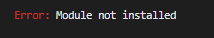

## Lab 03 - Creating Terraform Modules (DIY Exercise Challenge)

In this lab, you will learn how to create terraform modules that can be reused while deploying resources in multiple environments *(dev/prod/staging)*.

> **Estimated Duration**: 1 to 1.5 hours

---

#### <ins> What is a Module <ins>

A module is a container for multiple resources that are used together. Modules can be used to create lightweight abstractions, so that you can describe your infrastructure in terms of its architecture, rather than directly in terms of physical objects. The *.tf* files in your working directory when you run `terraform plan` or `terraform apply` together form the root module. That module may call other modules and connect them together by passing output values from one to input values of another.

An example use case for creating a module is a frontend and backend scenario. You may find it logical to make one module for your frontend, and one for your backend. Because you can create modules within modules, you may also find it logical to place both modules within a parent module that encompasses the whole solution. Please use this [doc](https://www.terraform.io/docs/modules/index.html#when-to-write-a-module) as guidance for understanding *when to write a module*. Because your terraform code is abstracted into modules, you can create releases specific to your dev, stage, and production environments by simply inputting a different *.tfvars* file respective to each stage in your release pipeline.

#### <ins> Lab03 Overview <ins>

In this lab, we will be following the *Standard Module Structure* as described in the official Terraform docs [here](https://www.terraform.io/docs/modules/index.html#standard-module-structure)

During this exercise, we will place the public ip code that we have been creating throughout section 1 and 2 in a module called *my-frontend-module* (**NOTE:** Simply placing a public ip in a module is not a good use case. These steps are built to simply walk through the standard module structure).

## <ins> DIY (Do it Yourself) Challenge (Estimated time of completion 1 hr) <ins>

In this exercise, you will create your own module named *my-frontend-module* by referencing the [Standard Module Structure](https://www.terraform.io/docs/modules/index.html#standard-module-structure). If you get stuck, feel free to peek through the VS Code *Explorer* pane at `C:\Lab_Files\M07_Terraform\terraform_lab_dir\m07-s03-e01-frontend-module`. You will see that the *m07-s03-e01-frontend-module* directory, has a `main.tf` file that simply mocks the *azurerm_public_ip* type of what is currently in the root main.tf found at `C:\Lab_Files\M07_Terraform\terraform_lab_dir\main.tf`. Similarly, `outputs.tf` has a copy of the output type and `variables.tf` has the variables to inject to the *azurerm_public_ip* object.

#### <ins> CHALLENGE REQUIREMENTS: <ins>

1.  You must deploy 2 azurerm_public_ip's (PIPs). First PIP should be named *"dev-pip"* with a tag *"environment: dev"*. Second PIP should be named *"prod-pip"* with a tag *"environment: prod"*. Both PIP names should NOT have WHITESPACE.

2.  You must use the `./configs/dev/m07-s03-e01-dev.tfvars` and `./configs/prod/m07-s03-e01-prod.tfvars` files WITHOUT editing the files. (Notice the whitespace on the environment variable)

3.  You must output the *azurerm_public_ip* object through the command line with the output variable name *"frontend_module"*. Example output like below:

#### <ins> Output: <ins>

```terraform
frontend_module = {
  "vmEndpoint" = {
    "allocation_method" = "Static"
    "id" = "/subscriptions/XXXXX/resourceGroups/YYYY/providers/Microsoft.Network/publicIPAddresses/prod-pip"
    "idle_timeout_in_minutes" = 4
    "ip_address" = "X.X.X.X"
    "ip_version" = "IPv4"
    "location" = "westus/eastus"
    "name" = "prod/dev-pip"
    "public_ip_address_allocation" = "Static"
    "resource_group_name" = "YYYY"
    "sku" = "Basic"
    "tags" = {
      "environment" = "prod/dev"
    }
    "zones" = []
  }
}
```

4.  Both PIPs must exist at the same time

5.  Use `./configs/prod/backend-prod.tfvars` when deploying `./configs/prod/m07-s03-e01-prod.tfvars` and `./configs/dev/backend-dev.tfvars` when deploying `./configs/dev/m07-s03-e01-dev.tfvars`. Please note that it’s a recommended practice to separate access from state files in lower environments from state files in higher environments like production. It is especially important since state files contain plain text (i.e. passwords) of the state of your target environment.

By the end of the challenge, you should have the following target components:

1.  Two state files in your Azure Storage Account like so:  
      
    

2.  Two resource groups in your Subscription like so:  
    

    

**NOTE:** If you need hints throughout this DIY challenge, feel free to check out the section below. Feel free to collaborate with your peers and ask your instructor for guidance throughout this challenge. You will probably stumble upon at least one roadblock along the way, but that's okay! We are all here to learn!

#### <ins> Extra Guidance and hints (if needed) <ins>

**HINTS!!!**

1.  Terraform has built-in [functions](https://www.terraform.io/docs/configuration/functions.html) that include string manipulation.

2.  You are creating a new module (rinse and repeat!). Don't forget what you learned in Lab 2! The backend state needs to be initialized when creating new modules.

3.  Remember where your configuration values for the azurerm provider exist. Don't forget what you learned in Lab 1 when running *terraform plan* and *terraform apply*!

4.  For requirement 3, checkout [this](https://www.terraform.io/docs/configuration/outputs.html#accessing-child-module-outputs)

5.  During this exercise, Terraform will eventually ask you, "Do you want to copy existing state to the new backend?" Do you…? In other words, do you want to copy your dev state into your prod state? What would happen to the first public ip you created if you were to say "yes" and apply that change?

6.  Feel free to take a look at `./m07-s03-e01-frontend-module` or the **"Full Solution Flow"** section below if you get stuck

#### <ins> Full Solution Flow (for a recap or extra guidance): <ins>

You may have followed these steps (in a different order):

1.  Created a folder `C:\Lab_Files\M07_Terraform\terraform_lab_dir\my-frontend-module`

2.  Created a file `README.md` with your choice of text

3.  Created a `main.tf` file and copied the root `main.tf` file's *azurerm_public_ip* resource object

```terraform
resource "azurerm_public_ip" "vm" {
  name                = "mypip""
  location            = data.azurerm_resource_group.main.location
  resource_group_name = data.azurerm_resource_group.main.name
  allocation_method   = "Static"

  tags = {
    environment = "dev"
  }
}
```

4.  Realized the first requirement and edited this code to be more dynamic and look something like:

```terraform
resource "azurerm_public_ip" "vm" {
  name                = "${var.environment}-pip"
  location            = var.location
  resource_group_name = var.rg_name
  allocation_method   = "Static"

  tags = {
    environment = var.environment
  }
}
```

5.  Looked at the `./configs/dev/m07-s03-e01-dev.tfvars` and `./configs/prod/m07-s03-e01-prod.tfvars` files and saw all the whitespace in the environment variable. You then realized the 2nd requirement. You took a look at the Terraform functions documentation and found this little gem, the [trimspace](https://www.terraform.io/docs/configuration/functions/trimspace.html) function. You then added something like this:


```terraform
resource "azurerm_public_ip" "vm" {
  name                = "${trimspace(var.environment)}-pip"
  location            = var.location
  resource_group_name = var.rg_name
  allocation_method   = "Static"

  tags = {
    environment = "${trimspace(var.environment)}"
  }
}
```

6.  You might've even done some research into how to not rewrite the trimspace logic by using [locals](https://www.terraform.io/docs/configuration/locals.html) like so:

```terraform
locals {
  environment = trimspace(var.environment) 
}

resource "azurerm_public_ip" "vm" {
  name                = "${local.environment}-pip"
  location            = var.location
  resource_group_name = var.rg_name
  allocation_method   = "Static"

  tags = {
    environment = local.environment
  }
}
```

7.  Because you just created the variables *environment*, *location*, *rg_name* and did not instantiate them anywhere, you created `./my-frontend-module/variables.tf` file with code like so:

```terraform
variable "location" {
    type = string
    description = "The location of the resource group"
    default = "eastus"
}

variable "environment" {
    type = string
    description = "The release stage of the environment"
    default = "dev"
}

variable "rg_name" {
    type = string
    description = "The release stage of the environment"
    default = "XXXXX"
}
```

8.  Realized that we still need to call this module from the root `main.tf` file and edited it like so (learn [here](https://www.terraform.io/docs/configuration/syntax.html#comments) about comments):

```terraform
terraform {
  required_providers {
    azurerm = {
      source  = "hashicorp/azurerm"
      version = "4.0.0"
    }
  }
      backend "azurerm" {
    }

}

provider "azurerm" {
  features {}

  subscription_id = var.azurerm_provider_subscription_id
}

data "azurerm_resource_group" "main" {
  name = var.rg_name
}

# resource "azurerm_public_ip" "vm" {
# name                = "mypip"
#  location            = data.azurerm_resource_group.main.location
#  resource_group_name = data.azurerm_resource_group.main.name
#  allocation_method   = "Static"
#  depends_on          = [data.azurerm_resource_group.main]
#
#    tags = {
#    environment = "dev"
#  }
#}

module "my_frontend_module" {
  source = "./my-frontend-module"

  location    = var.location
  environment = var.environment
  rg_name     = data.azurerm_resource_group.main.name
}
```

9.  Realized that *var.location* and *var.environment* do not exist at the root level and added it to the existing root `./variables.tf` file like so:

```terraform
variable "rg_name" {
  type        = string
  description = "The name of the resource group"
  default     = "XXXXX"
}

variable "azurerm_provider_subscription_id" {
  type        = string
  description = "Subscription ID"
  default     = "XXXXX"
}

variable "location" {
  type        = string
  description = "The location of the resource group"
  default     = "eastus"
}

variable "environment" {
  type        = string
  description = "The release stage of the environment"
  default     = "dev"
}
```

10.	Saw the 3rd requirement and realized that we already did something similar to that in the root folder's `outputs.tf`. Realized that the public ip object is now coded in a module. Said to yourself, "We first need to output the *azurerm_public_ip object* from the module. Then, output it from the root."

11.	You then created a `.\terraform_lab_dir\my-frontend-module\outputs.tf` file in the module that looks exactly how the original root `outputs.tf` file looks like:

```terraform
output "vmEndpoint" {
  value = azurerm_public_ip.vm
}
```

12.  You searched the internet for how to access child module outputs and found [this](https://www.terraform.io/docs/configuration/outputs.html#accessing-child-module-outputs). At the root `outputs.tf` file you coded:


```terraform
output "frontend_module" {
  value = "${module.my_frontend_module}"
}
```

13.  You might have ran…

```console
terraform plan -var-file="configs/dev/m07-s03-e01-dev.tfvars" -var-file="providers.tfvars" -out devplan
```

14.  …before running the init. You received the below error message if so:



15.  Because you created a new module and remembered this concept from lab 2's *setting the remote backend*, you realized that you first had to run:

```console
terraform init -backend-config="configs/dev/backend.tfvars" -backend-config="access_key=$env:ARM_ACCESS_KEY"
```

16.  You reran

```console
terraform plan -var-file="configs/dev/m07-s03-e01-dev.tfvars" -var-file="providers.tfvars" -out devplan
```

17.  You ran …

```console
terraform apply devplan
```

18.  … which outputs

```terraform
frontend_module = {
  "vmEndpoint" = {
    "allocation_method" = "Static"
    "ddos_protection_mode" = "VirtualNetworkInherited"
    "ddos_protection_plan_id" = tostring(null)
    "domain_name_label" = tostring(null)
    "edge_zone" = ""
    "fqdn" = tostring(null)
    "id" = "/subscriptions/XXXXXXXX/Terraform-Basic/providers/Microsoft.Network/publicIPAddresses/dev-pip"
    "idle_timeout_in_minutes" = 4
    "ip_address" = "13.0.0.1"
    "ip_tags" = tomap(null) /* of string */
    "ip_version" = "IPv4"
    "location" = "westus"
    "name" = "dev-pip"
    "public_ip_prefix_id" = tostring(null)
    "resource_group_name" = "Terraform-Basic"
    "reverse_fqdn" = tostring(null)
    "sku" = "Standard"
    "sku_tier" = "Regional"
    "tags" = tomap({
      "environment" = "dev"
    })
    "timeouts" = null /* object */
    "zones" = toset(null) /* of string */
  }
}
```

19.  You patted yourself on the back! Great job! You then set on a mission to deploy to production.

20.  You flawlessly remember to run terraform init first:

```console
terraform init -backend-config="configs/prod/backend.tfvars" -backend-config="access_key=$env:ARM_ACCESS_KEY"
```

21.  You are prompted with similar errors as below


22.  You realized that terraform has detected a state change in the backend configuration due to the different **tfstate file name** (`prod.terraform.tfstate`) in the `configs/prod/backend.tfvars` file, so you decide to run terraform init with -reconfigure option.

```console
terraform init -reconfigure -backend-config="configs/prod/backend.tfvars" -backend-config="access_key=$env:ARM_ACCESS_KEY"
```

23.  The initialization of prod terraform state should be successful now and you should see these state files created in your Azure Storage account.


24.  You ran

```console
terraform plan -var-file="configs/prod/m07-s03-e01-prod.tfvars" -var-file="providers.tfvars" -out prodplan
```

25.  You ran …

```console
terraform apply prodplan
```

26.  … which outputs

```terraform
frontend_module = {
  "vmEndpoint" = {
    "allocation_method" = "Static"
    "ddos_protection_mode" = "VirtualNetworkInherited"
    "ddos_protection_plan_id" = tostring(null)
    "domain_name_label" = tostring(null)
    "edge_zone" = ""
    "fqdn" = tostring(null)
    "id" = "/subscriptions/XXXXXX/resourceGroups/Terraform-Basic/providers/Microsoft.Network/publicIPAddresses/prod-pip"
    "idle_timeout_in_minutes" = 4
    "ip_address" = "14.0.0.1"
    "ip_tags" = tomap(null) /* of string */
    "ip_version" = "IPv4"
    "location" = "westus"
    "name" = "prod-pip"
    "public_ip_prefix_id" = tostring(null)
    "resource_group_name" = "Terraform-Basic"
    "reverse_fqdn" = tostring(null)
    "sku" = "Standard"
    "sku_tier" = "Regional"
    "tags" = tomap({
      "environment" = "prod"
    })
    "timeouts" = null /* object */
    "zones" = toset(null) /* of string */
  }
}
```

27.  You patted yourself on the back again! Great job!

#### <ins> Clean up <ins>

1.  Run terraform destroy to clean up your current prod environment. Enter **“yes”** to proceed with the cleanup.

```console
terraform destroy -var-file="providers.tfvars"
```

2.  Now, reinitialize the dev environment using the -reconfigure option we used before when switching from dev to prod environment

```console
terraform init -reconfigure -backend-config="configs/dev/backend.tfvars" -backend-config="access_key=$env:ARM_ACCESS_KEY"
```
  
**NOTE:** The reconfigure parameter is needed for terraform to reinitialize the dev environment

3.  Run terraform destroy again to destroy the dev environment. Enter **“yes”** to proceed with the cleanup.

```console
terraform destroy -var-file="providers.tfvars"
```

#### <ins> Conclusion <ins>

During this lab you:

1.  Created your own custom module.

2.  Managed using "separate" backend state mechanisms for different stages. This is meant to prepare you for deploying through a CI/CD pipeline.

3.  Learned about Terraform functions like trimspace.

4.  Learned how to output module objects.

**NOTE:** This lab exercise could have flowed more flawlessly if one were to use [terraform workspaces](https://www.terraform.io/docs/state/workspaces.html) or [terraform env](https://www.terraform.io/docs/commands/env.html) which is deprecated. However, the current issue with using *terraform workspaces* is that *workspaces* are purposed to use one backend. As the documentation states

*"Certain backends support multiple named workspaces, allowing multiple states to be associated with a single configuration. The configuration still has only one backend, but multiple distinct instances of that configuration to be deployed without configuring a new backend or changing authentication credentials."*

In other words, one Storage Account with one access key would be used against the dev environment AND prod environment in our scenario. For the sake of this exercise, we could have simply ran:

1.  **terraform workspace new dev** (This would have created a state file in the Storage Account container and appended ":dev" to the name)

2.  **terraform workspace new prod** (This would have created a state file in the Storage Account container and appended ":prod" to the name)

Ultimately, you would end up with a default state file, a dev, and a prod one. However, with security in mind, you may want to consider making the access mechanisms specific to each environment.

Run `terraform workspace list` to find out what workspace you have been using for this lab
