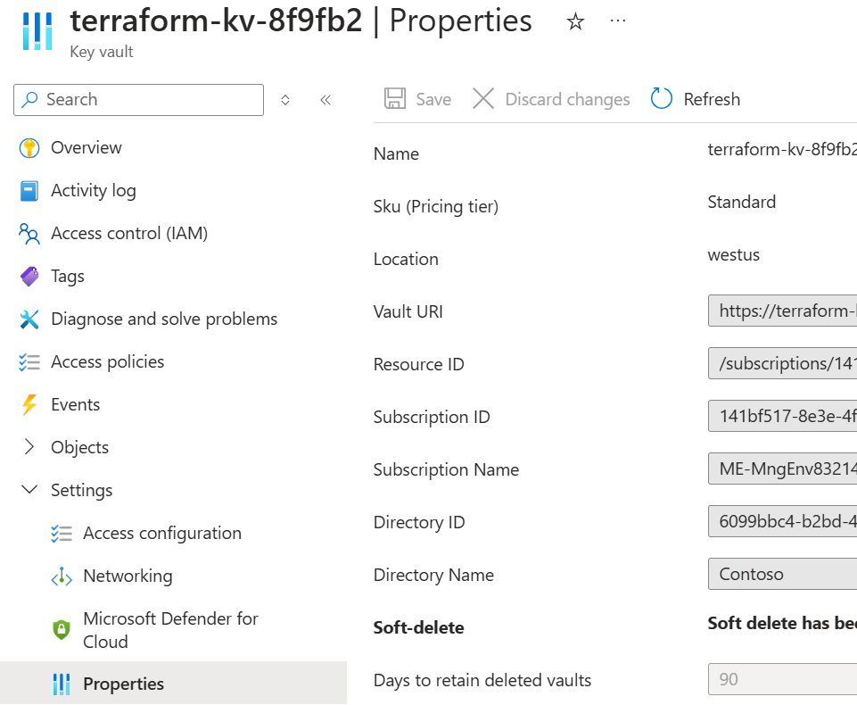
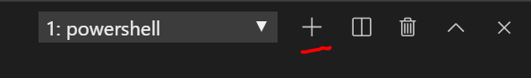

## Lab 04 - Deploying Resources

In this lab, we will learn how to deploy Azure Resources using basic Terraform mechanics. We will learn how to use Terraform's [depends_on](https://www.terraform.io/docs/configuration/resources.html#depends_on-explicit-resource-dependencies) meta-argument, [provisioner](https://www.terraform.io/docs/provisioners/index.html) types, [data](https://www.terraform.io/docs/configuration/data-sources.html) sources all while securing our secrets in Key Vault.

> **Estimated Duration**: 1 hour

---

#### <ins> Prerequisites <ins>

1.  We will create these resources in our *dev* environment. Run

```console
terraform init -backend-config="configs/dev/backend.tfvars" -backend-config="access_key=$env:ARM_ACCESS_KEY"
```

2.  If you haven't run this at the end of DIY challenge already, run the below command to destroy your target infrastructure generated from the challenge.

```console
terraform destroy -var-file="providers.tfvars"
```

#### <ins> Lab 04 Section (A) <ins>

We will be writing this code at the main.tf root level. This code can definitely be placed in its own module later on - as you have learned from lab 3. For the purpose of this lab, please develop under the root directory module. If you get lost at any point, please retrace your steps or you may review <https://github.com/sekar3s/Terraform-Lab/blob/main/m07-s04-final-solution.tf> which is the full and final solution that contains all three files: `outputs.tf, variables.tf, and main.tf` code.

1.  Open `./main.tf`

2.  Delete everything except

```terraform
terraform {
  required_providers {
    azurerm = {
      source  = "hashicorp/azurerm"
      version = "4.0.0"
    }
  }
      backend "azurerm" {
    }

}

provider "azurerm" {
  features {}

  subscription_id = var.azurerm_provider_subscription_id
}
```

3.  Open `./outputs.tf`

4.  Delete everything. We will output different resources during this lab.

5.  Save all / CTRL^S

#### <ins> Lab 04 Section (B) <ins>

1.  Open `./variables.tf`

2.  Ensure the below code exists

```terraform
###################################################
# Environment Specs
###################################################

variable "rg_name" {
  type        = string
  description = "The name of the resource group"
  default     = "XXXXX"
}

variable "azurerm_provider_subscription_id" {
  type        = string
  description = "Subscription ID"
  default     = "XXXXX"
}

variable "location" {
  type        = string
  description = "The location of the resource group"
  default     = "westus"
}

variable "environment" {
  type        = string
  description = "The release stage of the environment"
  default     = "dev"
}
```

#### <ins> Lab 04 Section (C) <ins>

In this section, we will need to reference our key vault created in lab 2. This Key Vault was not created by our Terraform code, rather the script found under `./helper_scripts/set_remote_backend.ps1`. We will learn how to interact with unmanaged Terraform resources during this lab like our Key Vault.

1.  Navigate to `./configs/dev/keyvault.tfvars` and insert the values shown in `./lab_output_logs/remote_backend.log` *(don’t worry about "key_value_resource_id" parameter for now)*

2.  Append the below lines to `./variables.tf`

```terraform
###################################################
# Key Vault Components
###################################################

variable "key_vault_name" {
  type        = string
  description = "the name of the main key vault"
  default     = "mykeyvault"
}
variable "key_vault_resource_id" {
  type        = string
  description = "the resource id of the main key vault"
  default     = "XXXXX"
}
variable "admin_pw_name" {
  type        = string
  description = "the admin password of the vm"
  default     = "admin-pw"
}
```

#### <ins> Lab 04 Section (D) <ins>

In this section, we will create a simple Azure Ubuntu VM. The vm will have a NIC with a public ip. The vm will sit inside a subnet within a vnet. The subnet will have a network security group with one security rule allowing port 22 for ssh.

1.  Navigate to `./main.tf`

2.  Place the code we created in the last lab (from the module main.tf) in our root `main.tf`

```terraform
locals {
  environment = trimspace(var.environment)
}
```

3.  Access the existing resource group like so:

```terraform
data "azurerm_resource_group" "main" {
  name = var.rg_name
}
```

4.  Create the network security group which will allow for port 22.

```terraform
resource "azurerm_network_security_group" "nsg" {
  name                = "nsg"
  location            = "${data.azurerm_resource_group.main.location}"
  resource_group_name = "${data.azurerm_resource_group.main.name}"

  security_rule {
    name                       = "AllowSSHIn"
    priority                   = 1300
    direction                  = "Inbound"
    access                     = "Allow"
    protocol                   = "Tcp"
    source_port_range          = "*"
    destination_port_range     = "22"
    source_address_prefix      = "*"
    destination_address_prefix = "*"
  }

  tags = {
    environment = local.environment
  }

  depends_on = [data.azurerm_resource_group.main]
}
```

Notice the *depends_on* meta-argument. The depends_on statement explicitly specifies a dependency. This is only necessary when a resource relies on some other resource's behavior, but does not access any of that resource's data in its arguments. Notice how this is not actually necessary as we are already accessing *data.azurerm_resource_group.main* arguments via *location* and *resource_group_name*. Nonetheless, it does not hurt to be explicit.

5.  Before we create a vm, we need to create the vnet that supports it. Paste the below vnet configuration. We will place the vm in subnet1. (For the purpose of the lab, we are hardcoding a couple values like the *address_prefix*. These values can be placed in variables later on)

```terraform
resource "azurerm_virtual_network" "main" {
  name                = "${local.environment}-network"
  address_space       = ["10.0.0.0/16"]
  location            = "${data.azurerm_resource_group.main.location}"
  resource_group_name = "${data.azurerm_resource_group.main.name}"

  subnet {
    name           = "subnet1"
    address_prefix = "10.0.0.0/24"
    security_group = "${azurerm_network_security_group.nsg.id}"
  }

  depends_on = [data.azurerm_resource_group.main, azurerm_network_security_group.nsg]
}
```

6.  We need to create the NIC. Notice in the [documentation](https://www.terraform.io/docs/providers/azurerm/r/network_interface.html) that we need to obtain the subnet id as part of the ip configuration of the NIC. The subnet1 resource is contained within the *azurerm_virtual_network.main* resource. azurerm_virtual_network.main.subnet will print out as an array of map. Rather than having to extrapolate the subnet id from azurerm_virtual_network.main.subnet, we can simply use the [data](https://www.terraform.io/docs/configuration/data-sources.html) source for [subnet](https://www.terraform.io/docs/providers/azurerm/r/subnet.html). We can do this by specifying the name, vnet name, and resource group name like so:

```terraform
data "azurerm_subnet" "subnet" {
  name                 = "subnet1"
  virtual_network_name = "${local.environment}-network"
  resource_group_name  = "${data.azurerm_resource_group.main.name}"
}
```

7.  Now, we can create our NIC and attach it to subnet1 like so:

```terraform
resource "azurerm_network_interface" "vm" {
  name                = "${local.environment}-nic"
  location            = "${data.azurerm_resource_group.main.location}"
  resource_group_name = "${data.azurerm_resource_group.main.name}"

  ip_configuration {
    name                          = "ipconfig"
    subnet_id                     = data.azurerm_subnet.subnet.id
    private_ip_address_allocation = "Dynamic"
    public_ip_address_id          = "${azurerm_public_ip.vm.id}"
  }

  depends_on = [data.azurerm_resource_group.main, azurerm_virtual_network.main, azurerm_public_ip.vm]
}
```

8.  Create the Public IP

```terraform
resource "azurerm_public_ip" "vm" {
  name                = "mypip"
  location            = data.azurerm_resource_group.main.location
  resource_group_name = data.azurerm_resource_group.main.name
  allocation_method   = "Static"
  depends_on          = [data.azurerm_resource_group.main]
}
```

9.  The ubuntu machine that we will be creating will use a simple password and username to logon to the machine. First we need to retrieve the existing Key Vault secret that was generated in lab 2 by the `./helper_scripts/set_remote_backend.ps1` script. Add the below to your `main.tf` file:

```terraform
data "azurerm_key_vault_secret" "main" {
  name         = var.admin_pw_name
  key_vault_id = var.key_vault_resource_id
}
```

10.  Lets create a locals argument for the vm configuration

```terraform
locals {
  vm = {
    computer_name = "vm1"
    user_name     = "admin1234"
  }
}
```

11.  Create the ubuntu machine

```terraform
resource "azurerm_virtual_machine" "vm" {

  name                  = "${local.environment}-vm"
  location              = "${data.azurerm_resource_group.main.location}"
  resource_group_name   = "${data.azurerm_resource_group.main.name}"
  network_interface_ids = ["${azurerm_network_interface.vm.id}"]
  vm_size               = "Standard_DS1_v2"

  storage_image_reference {
    publisher = "Canonical"
    offer     = "UbuntuServer"
    sku       = "20.04-LTS"
    version   = "latest"
  }
  storage_os_disk {
    name              = "myosdisk1"
    caching           = "ReadWrite"
    create_option     = "FromImage"
    managed_disk_type = "Standard_LRS"
  }
  os_profile {
    computer_name  = local.vm.computer_name
    admin_username = local.vm.user_name
    admin_password = data.azurerm_key_vault_secret.main.value
  }
  os_profile_linux_config {
    disable_password_authentication = false
  }
  tags = {
    environment = local.environment
  }

  depends_on = [data.azurerm_resource_group.main, azurerm_virtual_network.main]

}
```

#### <ins> Lab 04 Section (E) <ins>

1.  Navigate to `./outputs.tf` and let's include our vm endpoint info

```terraform
output "vmEndpoint" {
  value = azurerm_public_ip.vm.ip_address
}
output "username" {
  value = local.vm.user_name
}
output "password" {
  value = data.azurerm_key_vault_secret.main.value
}
```

#### <ins> Lab 04 Section (F) <ins>

1.  CTRL^S to save `main.tf, variables.tf, and outputs.tf` in the root directory

2.  Run `terraform fmt`. [This](https://www.terraform.io/docs/commands/fmt.html) will format the spacing of your code.

```console
terraform fmt
```

3.  Go to <https://portal.azure.com>

4.  Navigate to the key vault under your resource group, click Properties under Settings, **copy** the resource id to be pasted during the next step



5.  Go to `./configs/dev/keyvaults.tfvars` and replace the value as advised in the current value for *key_vault_name* and *key_vault_resource_id*

```terraform
# To be filled in lab 4
key_vault_name="<insert key_vault_name value from ..\..\lab_output_logs\remote_backend.log>"
key_vault_resource_id="<insert key_vault_resource_id value from the previous step of Lab Continued (F)"
admin_pw_name="admin-pw"
```

#### <ins> CHECKPOINT 1 <ins>

At this point you should have the following code complete:

1.  `./configs/dev/keyvaults.tfvars`

2.  `variables.tf` like so:

```terraform
###################################################
# Environment Specs
###################################################
variable "location" {
  type        = string
  description = "The location of the resource group"
  default     = "westus"
}

variable "environment" {
  type        = string
  description = "The release stage of the environment"
  default     = "dev"
}

variable "rg_name" {
  type        = string
  description = "The name of the resource group"
  default     = "XXXXX"
}

variable "azurerm_provider_subscription_id" {
  type        = string
  description = "Subscription ID"
  default     = "XXXXX"
}

###################################################
# Key Vault Components
###################################################
variable "key_vault_name" {
  type        = string
  description = "the name of the main key vault"
  default     = "mykeyvault"
}
variable "key_vault_resource_id" {
  type        = string
  description = "the resource id of the main key vault"
  default     = "XXXXX"
}
variable "admin_pw_name" {
  type        = string
  description = "the admin password of the vm"
  default     = "admin-pw"
}
```

3.  `./main.tf` like so:

```terraform
terraform {
  required_providers {
    azurerm = {
      source  = "hashicorp/azurerm"
      version = "4.0.0"
    }
  }
  backend "azurerm" {
  }
}

provider "azurerm" {
  features {}

  subscription_id = var.azurerm_provider_subscription_id
}

locals {
  environment = trimspace(var.environment)
}

data "azurerm_resource_group" "main" {
  name = var.rg_name
}

resource "azurerm_network_security_group" "nsg" {
  name                = "nsg"
  location            = data.azurerm_resource_group.main.location
  resource_group_name = data.azurerm_resource_group.main.name

  security_rule {
    name                       = "AllowSSHIn"
    priority                   = 1300
    direction                  = "Inbound"
    access                     = "Allow"
    protocol                   = "Tcp"
    source_port_range          = "*"
    destination_port_range     = "22"
    source_address_prefix      = "*"
    destination_address_prefix = "*"
  }

  tags = {
    environment = local.environment
  }

  depends_on = [data.azurerm_resource_group.main]
}

resource "azurerm_virtual_network" "main" {
  name                = "${local.environment}-network"
  address_space       = ["10.0.0.0/16"]
  location            = data.azurerm_resource_group.main.location
  resource_group_name = data.azurerm_resource_group.main.name
}

resource "azurerm_subnet" "subnet" {
    virtual_network_name = azurerm_virtual_network.main.name
    resource_group_name = data.azurerm_resource_group.main.name
    name           = "subnet1"
    address_prefixes = ["10.0.0.0/24"]

  depends_on = [data.azurerm_resource_group.main, azurerm_network_security_group.nsg]
}

data "azurerm_subnet" "subnet" {
  name                 = "subnet1"
  virtual_network_name = "${local.environment}-network"
  resource_group_name  = data.azurerm_resource_group.main.name

  depends_on = [azurerm_virtual_network.main, azurerm_subnet.subnet]
}

resource "azurerm_subnet_network_security_group_association" "nsg-association" {
  subnet_id                 = azurerm_subnet.subnet.id
  network_security_group_id = azurerm_network_security_group.nsg.id
}

resource "azurerm_network_interface" "vm" {
  name                = "${local.environment}-nic"
  location            = data.azurerm_resource_group.main.location
  resource_group_name = data.azurerm_resource_group.main.name

  ip_configuration {
    name                          = "ipconfig"
    subnet_id                     = data.azurerm_subnet.subnet.id
    private_ip_address_allocation = "Dynamic"
    public_ip_address_id          = azurerm_public_ip.vm.id
  }

  depends_on = [data.azurerm_resource_group.main, azurerm_virtual_network.main, azurerm_public_ip.vm]
}

resource "azurerm_public_ip" "vm" {
  name                = "mypip"
  location            = data.azurerm_resource_group.main.location
  resource_group_name = data.azurerm_resource_group.main.name
  allocation_method   = "Static"
  depends_on          = [data.azurerm_resource_group.main]
}

data "azurerm_key_vault_secret" "main" {
  name         = var.admin_pw_name
  key_vault_id = var.key_vault_resource_id
}

locals {
  vm = {
    computer_name = "vm1"
    user_name     = "admin1234"
  }
}

resource "azurerm_linux_virtual_machine" "vm" {

  name                  = "${local.environment}-vm"
  location              = data.azurerm_resource_group.main.location
  resource_group_name   = data.azurerm_resource_group.main.name
  network_interface_ids = ["${azurerm_network_interface.vm.id}"]
  size               = "Standard_DS1_v2"

  source_image_reference {
    publisher = "Canonical"
    offer     = "0001-com-ubuntu-server-jammy"
    sku       = "22_04-lts-gen2"
    version   = "latest"
  }
  os_disk {
    name              = "myosdisk1"
    caching           = "ReadWrite"
    storage_account_type = "Premium_LRS"
  }

  computer_name  = local.vm.computer_name
  admin_username = local.vm.user_name
  admin_password = data.azurerm_key_vault_secret.main.value
  disable_password_authentication = false
  
  tags = {
    environment = local.environment
  }

  depends_on = [data.azurerm_resource_group.main, azurerm_virtual_network.main]
}
```

4.  `./outputs.tf` like so:

```terraform
output "vmEndpoint" {
  value = azurerm_public_ip.vm.ip_address
}
output "username" {
  value = local.vm.user_name
}
output "password" {
  value = nonsensitive(data.azurerm_key_vault_secret.main.value)
}
```

#### <ins> Lab 04 Section (G) <ins>

Let's run the three step process

1.  Terraform Init
```console
terraform init -backend-config="configs/dev/backend.tfvars" -backend-config="access_key=$env:ARM_ACCESS_KEY"
```

2.  Terraform Plan
```console
terraform plan -var-file="providers.tfvars" -var-file="configs/dev/keyvault.tfvars" -out myplan
```

3.  Terraform Apply
```console
terraform apply myplan
```

4.  Open a new powershell session by navigating to the terminal and clicking on the "+" icon. 

5.  After you apply, you should see credentials for logging on. Run 

```console
ssh <username>@<vmEndpoint value>
```

6.  When prompted, enter yes

7.  Enter the password value, which can be found from the output of terraform apply

#### <ins> CHECKPOINT 2 <ins>

At this point, we have created a fully functional Azure Virtual Machine with Ubuntu.

#### <ins> CONCLUSION <ins>

In this lab, you learned

1.  How to deploy multiple resources that depend on each other.

2.  How to manage resources that are not deployed by Terraform
