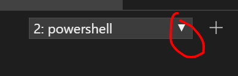

## Lab 05 (OPTIONAL) - Provision/Automate Changes on Virtual Machine

In this lab, we will implement a provisioner script to automate workflows within a virtual machine using terraform [provisioner](https://www.terraform.io/docs/provisioners/index.html).

## PRE-REQUISITE!!!

Before running this lab, you should have deployed a fully functional virtual machine that you can connect to using SSH. Please complete the previous labs before working on this one.

> **Estimated Duration**: 1 hour

---

#### <ins> Provisioner Script <ins>

Provisioners are used to execute scripts on a local or remote machine as part of resource creation or destruction. Provisioners can be used to bootstrap a resource, cleanup before destroy, run configuration management, etc. Let's run a script on our machine.

Create a file within the `/terraform_lab_dir/`, called `test.sh` with the below content.

```shell
#!/bin/bash

# args=("$@") 
 echo "Hello World"
# echo -e "\nhash -> " ${args[0]}
# echo -e $(date)
# echo -e "whoami -> $(whoami)"
```

We will copy this file to the machine by using using [file provisioner](https://www.terraform.io/docs/provisioners/file.html) and execute it via [azurerm_virtual_machine_extension](https://www.terraform.io/docs/providers/azurerm/r/virtual_machine_extension.html). The operations we want to execute on the machine are like so (You don't have to execute the commands below. We will configure it to run on the vm in the following sections):

1.  chmod +x ./test.sh to make the script executable

2.  bash test.sh \>\> ./helloworld.log to execute the script and append the output to helloworld.log

The script will:

a.  print the date

b.  print "Hello World"

#### <ins> Lab 04 Section (A) <ins>

1.  Open `./main.tf*`

2.  Use [null_resource](https://www.terraform.io/docs/providers/null/resource.html) which implements the standard resource lifecycle but takes no further action. It is basically a mechanism for running operations to supplement IaC without creating your standard resources like vms, vnets, vpcs.

```terraform
resource "null_resource" remoteExecProvisioner {

}
```

3.  Let's create a local variable for the directory of the script. Add the below code:

```terraform
locals {
  scriptWorkingDir = "/home/${local.vm.user_name}/"
}
```

4.  To copy the file, let's use the [file provisioner](https://www.terraform.io/docs/provisioners/file.html). Within *file provisioner*, you provide a source, where your file exists, and destination, where to place the file on the remote machine once copied. Place this code inside the *null_resource.remoteExecProvisioner* brackets.

```terraform
  provisioner "file" {
    source      = "./test.sh"
    destination = "${local.scriptWorkingDir}/test.sh"
  }
```

5. We also need to access the remote resource. We can simply ssh with the username and password by using the [connection provisioner](https://www.terraform.io/docs/provisioners/connection.html) like below. Place this code inside the *null_resource.remoteExecProvisioner* brackets.

```terraform
connection {
    host     = azurerm_public_ip.vm.ip_address
    type     = "ssh"
    user     = local.vm.user_name
    password = data.azurerm_key_vault_secret.main.value
    agent    = "false"
  }
```

6.  We need to ensure the vm and the ssh port are set before attempting to copy the file. If we *plan* and *apply* at this point, you will most likely receive an error without the below code existing inside the *null_resource.remoteExecProvisioner* brackets.:

```terraform
depends_on = [azurerm_linux_virtual_machine.vm, azurerm_network_security_group.nsg]
```

At the end of Lab 04 Section (H), you should have added the below code to `main.tf`:

```terraform
locals {
  scriptWorkingDir = "/home/${local.vm.user_name}/"
}

resource "null_resource" remoteExecProvisioner {

provisioner "file" {
    source      = "./test.sh"
    destination = "${local.scriptWorkingDir}/test.sh"
  }

connection {
    host     = azurerm_public_ip.vm.ip_address
    type     = "ssh"
    user     = local.vm.user_name
    password = data.azurerm_key_vault_secret.main.value
    agent    = "false"
  }

  depends_on = [azurerm_linux_virtual_machine.vm, azurerm_network_security_group.nsg]
}
```

#### <ins> Lab 04 Section (B) <ins>

Let's create the [custom script extension](https://www.terraform.io/docs/providers/azurerm/r/virtual_machine_extension.html) that will execute our bash script. Ensure *null_resource.remoteExecProvisioner* is referenced in the depends_on object.

1.  Open `./main.tf`

2.  Append the below code:

```terraform
resource "azurerm_virtual_machine_extension" "main" {
  virtual_machine_id   = azurerm_linux_virtual_machine.vm.id
  name                 = "hostname"
  publisher            = "Microsoft.Azure.Extensions"
  type                 = "CustomScript"
  type_handler_version = "2.0"

  settings = <<SETTINGS
  {
    "commandToExecute": "chmod +x ${local.scriptWorkingDir}/test.sh; sudo apt-get install dos2unix; dos2unix ${local.scriptWorkingDir}/test.sh; /bin/bash ${local.scriptWorkingDir}/test.sh >> ${local.scriptWorkingDir}/helloworld.log"
  }
  SETTINGS

  tags = {
    environment = local.environment
  }

  depends_on = [azurerm_linux_virtual_machine.vm, azurerm_network_security_group.nsg, null_resource.remoteExecProvisioner]
}
```

The values placed in the commandToExecute object above are unix commands that will:

1.  Make the `test.sh` file executable

2.  Install [dos2unix](https://linux.die.net/man/1/dos2unix) command line tool to convert test.sh to a UNIX format.

3.  Convert the test.sh to UNIX format

4.  Run the script and append it to `helloworld.log`

#### <ins> Lab 04 Section (C) <ins>

At this point, you can:

1.  Save the changes (Go to File and click Save All)

2.  Return to the original terminal session by clicking on the carrot and selecting the 1st session. 

3.  Run Terraform Init

```console
terraform init -backend-config="configs/dev/backend.tfvars" -backend-config="access_key=$env:ARM_ACCESS_KEY"
```

4.  Run Terraform Plan

```console
terraform plan -var-file="providers.tfvars" -var-file="configs/dev/keyvault.tfvars" -out myplan
```

5.  Run Terraform Apply 

```console
terraform apply myplan
```

6.  Go back to the the remote session. Run and enter the password if prompted

```console
ssh <username>@<vmEndpoint value> 
```

7.  List the files 

```console
ls
```

8.  You will see the files `helloworld.log` and `test.sh`

9.  Out helloworld.log 

```console
cat helloworld.log
```

10. You will see as output:

```console
Hello World

--------------------------------
```

#### <ins> CHECKPOINT <ins>

At this point we copied a file and ran it through a custom script extension. If we were to make incremental changes to our `./test.sh` script, our terraform code would actually not acknowledge that the file has changed. Terraform will see that test.sh is still the file to execute and will not see a difference.

#### <ins> Lab 04 Section (D) <ins>

Let's test this:

1.  Navigate to `./test.sh`

2.  Uncomment the below code

```shell
echo -e $(date)
```

3.  Save your work (Go to File and click Save All)

4.  Return to the original terminal session by clicking on the carrot and selecting the 1st session. 

5.  Run Terraform Init

```console
terraform init -backend-config="configs/dev/backend.tfvars" -backend-config="access_key=$env:ARM_ACCESS_KEY"
```

6.  Run Terraform Plan
```console
terraform plan -var-file="providers.tfvars" -var-file="configs/dev/keyvault.tfvars" -out myplan
```

7.  Run Terraform Apply
```console
terraform apply myplan
```

8.  Go back to the the remote session. Run and enter the password if prompted

```console
ssh <username>@<vmEndpoint value> 
```

9.  List the files 

```console
ls
```

10.  You will see the files `helloworld.log` and `test.sh`

11.  Run `cat helloworld.log` and you will not see a date (you will see the same as before)

12.  Run `cat test.sh` and you will not see the uncommented code


#### <ins> Lab 04 Section (E) <ins>

Let's fix this. The way we can plan and apply incremental script changes is by the [triggers](https://www.terraform.io/docs/providers/null/resource.html#triggers) argument.

For Terraform to see that there is a difference in the file, we can do the below steps:

1.  Open `./main.tf`

2.  Let's generate and [archive](https://www.terraform.io/docs/providers/archive/d/archive_file.html) a zip file of test.sh so that later, we can take a hash of the zip file. Everytime the zip file hash changes, Terraform will know to trigger the script again.

```terraform
data "archive_file" "init" {
  type        = "zip"
  source_file = "${path.module}/test.sh"
  output_path = "${path.module}/test.zip"
}
```

**NOTE:** *path.module* is a built in terraform variable for finding the current working directory of your terraform root module.

3.  Within *null_resource.remoteExecProvisioner* brackets, place the below code which will grab the hash from data.archive_file.init:

```terraform
  triggers = {
    src_hash = "${data.archive_file.init.output_sha}"
  }
```

4.  Go to `./test.sh`

5.  Uncomment `args=("$@")` and `echo -e "\nhash -> " ${args[0]}`

6.  Save the changes

7.  Navigate to `./main.tf`

8.  Under *azurerm_virtual_machine_extension.main.settings*, replace the "commandToExecute" value to include the argument like so and save the file:

```terraform
"commandToExecute": "chmod +x ${local.scriptWorkingDir}/test.sh; sudo apt-get install dos2unix; dos2unix ${local.scriptWorkingDir}/test.sh; /bin/bash ${local.scriptWorkingDir}/test.sh ${data.archive_file.init.output_sha} >> ${local.scriptWorkingDir}/helloworld.log"
```

9.  Return to the original terminal session by clicking on the carrot and selecting the 1st session. 

10.  Run Terraform Init to intialize the archive_file provisioner

```console
terraform init -backend-config="configs/dev/backend.tfvars" -backend-config="access_key=$env:ARM_ACCESS_KEY"
```

11.  Run Terraform Plan 

```console
terraform plan -var-file="providers.tfvars" -var-file="configs/dev/keyvault.tfvars" -out myplan
```

12. Run Terraform Apply

```console
terraform apply myplan
```

13. Go back to the the remote session. Run and enter the password if prompted

```console
ssh <username>@<vmEndpoint value> 
```

14. List the files 

```console
ls
```

15. You will see the files `helloworld.log` and `test.sh`

16. Run `cat helloworld.log` and you should see that this time it was successful in appending the output of test.sh with something similar to the below output:

```console
Hello World
hash -> 65d6812a83744bac8b16e09af2cf945b3c8539c8
Fri Sep 6 20:14:57 UTC 2019
Hello World
```

#### <ins> Lab 04 Section (F) <ins>

Terraform was able to see the difference because you ultimately changed the commandToExecute value. This is why we see the above output. Let's actually put this incremental change code to the test now.

1.  Navigate to `./test.sh`

2.  Uncomment `echo -e "whoami -> $(whoami)"`

3.  Save the work

4.  Return to the original terminal session by clicking on the carrot and selecting the 1st session. 

5.  Run Terraform Init to intialize the archive_file provisioner

```console
terraform init -backend-config="configs/dev/backend.tfvars" -backend-config="access_key=$env:ARM_ACCESS_KEY"
```

6.  Run Terraform Plan

```console
terraform plan -var-file="providers.tfvars" -var-file="configs/dev/keyvault.tfvars" -out myplan
```

7.  Run Terraform Apply 

```console
terraform apply myplan
```

8.  Go back to the the remote session. Run and enter the password if prompted

```console
ssh <username>@<vmEndpoint value> 
```

9.  List the files 

```console
ls
```

10. You will see the files `helloworld.log` and `test.sh`

11. Run `cat helloworld.log` and you should see output of the whoami command

#### <ins> CONCLUSION <ins>

**Congrats! In this lab, you learned how to provision a machine with incremental changes**
